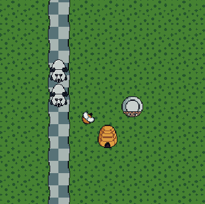

# Honey-Heist

https://anmoose.itch.io/honey-heist

A 2D tower defense game created in the Unity Engine. Pesky bears are looking to steal your honey. Move around your beehive so your bees can help you defend your honey stash! While holding your beehive use the points you collected to upgrade the damage, speed, and range.

**Controls**
- W, A, S, D or Arrow Keys ...................... Move
- Space Bar .................................................... Place/Pick up Tower
- Z ...................................................................... Upgrade Damage
- X....................................................................... Upgrade Range
- C....................................................................... Upgrade Speed
- Enter............................................................... Start Next Level

All assets and code were created custom. Key features from this game include:
- Custom grid system to determine valid valid tower placement.
- Custom editor that uses the grid system to design levels and save the level information in JSON format for loading (only available in the Unity Editor).

